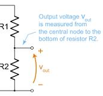

 

This is a Readme file for Battery_Health_Monitor (BHM) COMPONENT. 

 

Implementation is based on the [Documentation reference](https://docs.espressif.com/projects/esp-idf/en/v4.1.1/api-reference/peripherals/adc.html). 

 

 

|Date|28-12-2023| 
|:-:|:-:| 
|Responsible|KRISHNA.TL| 
|Reviewed by|SHRUTHI.KR| 
|SUPPORTED_DEVICES|only ESP_32-WROOM-32E CONTROLLERS| 

 

 

# A) Primary functions of the component: 

This BHM component is used to measure the ADC voltage across GPIO_34 (ADC1_CHANNEL_6)  

and convert that ADC voltage into battery level Indication (Based on Battery draining voltage). 


 The current component uses the following values as default 
 - i) >4.3V battery voltage represents 100 % of battery . 
 - ii) <2.6V battery voltage represents 0 % of battery . 
   

|battery capacity|(1500mah)| 
|:-:|:-:| 
|battery used|| 
 

 where voltage divider resistors (R1,R2)   

     

 R1=200Kohm,
  
 R2=810Kohm (voltage across R2 is connected to GPIO_34), 

 Note: R1 (lowest resistor) and R2 (highest resistor – 4xR1) maybe represented with different indicators, e.g R(n), R(m), etc..   

 If you want to try different resistors and batteries with different threshold levels (e.g 3.6V, 5.1V, etc..), please refer to the following excel sheet and change the variables based on the values calculated in the below excel sheet. 

  [ADC_EXCEL](https://xaglabs.sharepoint.com/:x:/r/sites/MiiOffice/_layouts/15/Doc.aspx?sourcedoc=%7B3C39914B-7B70-440C-9E03-99C0FDE8FC5D%7D&file=ADC%20Test%20Report_ABHI%2027FEB23.xlsx&action=default&mobileredirect=true) 

 
 

# B) How to use the component: 

 __1. Add the BHM component to the COMPONENT folder, add BHM into the COMPONENT CMakeLists , and include bhm `header` file into the main program.__ 

   ``` 

         #include"bhm.h"  

   ``` 

__2. First Initialise the Battery_Health_Monitor by using the following API__  

   ``` 

         void battery_health_measuring_initialisations(); 

   ``` 

Note: 

The above API will install the ADC1_DRIVER to measure the ADC voltage for GPIO_PIN_34.  

 

__3. After Initialisation,call the Battery_Health_Monitor API to know the Battery Percentage across the GPIO_34__ 

  ``` 

         int batteryhealthmonitor(); 

  ``` 

Note: 

The above API calculates the battery percentage for an average of 50 READINGs across the GPIO_34.(Default pin is set to 34) 

 

`@note: In order to change the GPIO_PIN to different pin, use the link to replace ADC1_CHANNEL_6 with any` [analog pin](https://docs.espressif.com/projects/esp-idf/en/v4.1.1/api-reference/peripherals/adc.html#enumerations)                     

 

__4. Then deinitialise the power to the ADC1_DRIVER by calling following API__ 

   ``` 

        void bhm_deinit(); 

   ``` 

 

# C) How to add a component to your project: 

__1. Let us take a component named as `abc`. Follow the steps below to add the `abc` component to your project.__ 

``` 

├── build 

├── components 

|   ├──abc       // this is the abc component folder containing abc.c, abc.h, README.md, CMakelists.txt and test procedure document 

|   ├──abc.h    // create a file called abc.h and copy the contents of abc.h file from the abc component folder  

|   └──CMakeLists.txt   // if a CMakeLists.txt files exists, follow Step 3. If not create a CMakeLists.txt file and follow Step 2 

├── main 

│   ├── CMakeLists.txt 

│   └── main.c 

└── README.md                  This is the file you are currently reading 

``` 

 

__2. Open the `CMakeLists.txt` file in the `abc` component folder and edit with the below text.__ 

``` 

idf_component_register(SRCS "abc/abc.c"  

                    INCLUDE_DIRS "." 

                    PRIV_REQUIRES driver) 

``` 

__3. If adding another component to existing `CMakeLists.txt file`, first follow Step 1 as above and then edit the existing `CMakeList.txt` with the following text. For this example, we will add another component named `xyz`.__ 

``` 

idf_component_register(SRCS "abc/abc.c" "xyz/xyz.c" 

                    INCLUDE_DIRS "." 

                    PRIV_REQUIRES driver) 

``` 

__4. After completing the above process, build the program. If error persists, then go to the esp-idf documentation for `PRIV_REQUIRES`.__ 

``` 

idf_component_register(SRCS "abc/abc.c" "xyz/xyz.c" 

                    INCLUDE_DIRS "." 

                    PRIV_REQUIRES driver abc_driver xyz_driver) 

``` 

# D) Fault_Analysis 

__This will be added in future .__ 

 

 

 
